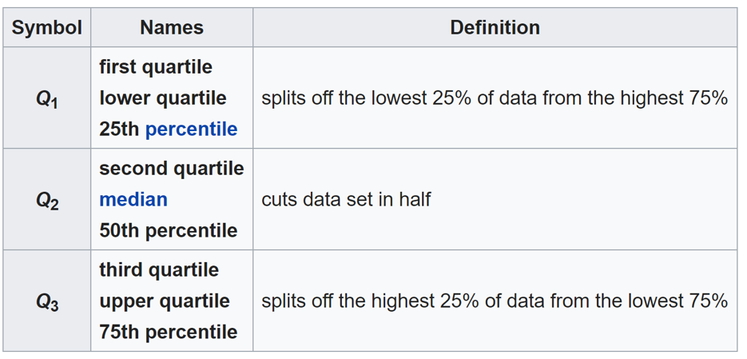

```{r setup, include = FALSE}
knitr::opts_chunk$set(echo = TRUE, warning = FALSE, message = FALSE)
options(tinytex.verbose = T)

options(scipen = 999)
library(ggplot2)
library(dplyr)
library(knitr)
library(reticulate)
library(Hmisc)
library(HistData)
library(ggthemes)
library(gridExtra)
library(ggpubr)
library(RColorBrewer)
library(wesanderson)
```


# Grammar of graphics

## Grammar of graphics

There are few definitions of what grammar is
\hfill\break

**“the whole system and structure of a language or of languages in general, usually taken as consisting of syntax and morphology (including inflections) and sometimes also phonology and semantics”**

\hfill\break

**grammar is “the fundamental principles or rules of an art or science”**


## Grammar of graphics

**Grammar gives language rules. The word stems from the Greek noun for letter or mark. And that derives from the Greek verb for writing, which is the source of English word graph. Grammar means, more generally, rules for art and science, as in the richly illustrated The Grammar of Ornament (Jones, 1856), and Karl Pearson’s The Grammar of Science (Pearson, 1892)**

\hfill\break

*(Leland Wilkinson)*


## Grammar of graphics

**Grammar has a technical meaning in linguistics. In the transformational theory of Chomsky (1956), a grammar is a formal system of rules for generating lawful statements in a language.**

\hfill\break

*(Leland Wilkinson)*


## Grammar of graphics

**Grammar makes language expressive. A language consisting of words and no grammar (statement = word) expresses only as many ideas as there are words. By specifying how words are combined in statements, a grammar expands a language’s scope.**


## Grammar of graphics

*(Leland Wilkinson)*

```{r, echo = F, out.width = "80%"}

```


## Grammar of graphics


- ELEMENT: point(position(birth*death), size(0), label(country)) 
- ELEMENT: contour(position(smooth.density.kernel.epanechnikov.joint(birth*death)),
  color.hue())
- GUIDE: form.line(position((0,0),(30,30)), label("Zero Population Growth")) 
- GUIDE: axis(dim(1), label("Birth Rate"))
- GUIDE: axis(dim(2), label("Death Rate"))

\hfill\break

*(Leland Wilkinson)*


## Grammar of graphics

What are some other elements and guides that you see on the graph ?


## Grammar of graphics

ggplot2

\hfill\break

**ggplot2 is an R package for producing statistical, or data, graphics, but it is unlike most other graphics packages because it has a deep underlying grammar. This grammar, based on the Grammar of Graphics (Wilkinson, 2005), is composed of a set of independent components that can be composed in many different ways. This makes ggplot2 very powerful, because you are not limited to a set of pre-specified graphics, but you can create new graphics that are precisely tailored for your problem. This may sound overwhelming, but because there is a simple set of core principles and very few special cases, ggplot2 is also easy to learn (although it may take a little time to forget your preconceptions from other graphics tools).**

\hfill\break

*(Hadley Wickham)*


## Grammar of graphics

- Learning the grammar will help you not only create graphics that you know about now, but will also help you to think about new graphics that would be even better.
- Without the grammar, there is no underlying theory and existing graphics packages are just a big collection of special cases. 


## Grammar of graphics

Layered grammar of graphics

\hfill\break

**ggplot2 is designed to work in a layered fashion, starting with a layer showing the raw data then adding layers of annotations and statistical summaries.**


## ggplot2

In ggplot the graph building process always starts with **ggplot()** layer
\hfill\break

Get the data mpg from the library ggplot2

```{r}
data(mpg)
```


## ggplot2

The result is an empty space

```{r, out.height='65%'}
ggplot(data = mpg, aes(x = hwy, y = cty))
```


## ggplot2

If you want to have a chart, add additional *layer*

```{r, out.height='65%'}
ggplot(data = mpg, mapping = aes(x = hwy, y = cty)) +
  geom_point()
```


## ggplot2

*Elements of grammar of graphics*

- The **data** that you want to visualize and a set of aesthetic mappings describing how variables in the data are mapped to aesthetic attributes that you can perceive.
- **Geometric objects**, geoms for short, represent what you actually see on the plot: points, lines, polygons, etc.
- **Statistical transformations**, stats for short, summarise data in many useful ways. For example, binning and counting observations to create a histogram, or summarising a 2d relationship with a linear model. Stats are optional, but very useful.
- The **scales** map values in the data space to values in an aesthetic space, whether it be colour, or size, or shape. Scales draw a legend or axes, which provide an inverse mapping to make it possible to read the original data values from the graph.


## ggplot2 (continued)

- A **coordinate system**, coord for short, describes how data coordinates are mapped to the plane of the graphic. It also provides axes and gridlines to make it possible to read the graph. We normally use a Cartesian coordinate system, but a number of others are available, including polar coordinates and map projections.
- A **faceting** specification describes how to break up the data into subsets and how to display those subsets as small multiples. This is also known as conditioning or latticing/trellising.


## ggplot2

ggplot2 uses shortcuts for the elements

- geom_XXX - for geometric objects
- stat_XXX - for statistical transformations
- scale_ - for scales
- coord_XXX for coordinate systems
- facet_ - for faceting


## ggplot2

If you want to see what are the geometric objects available as a layer for ggplot, just type geom_ .
\hfill\break
*line chart*

```{r, out.height='65%'}
ggplot(data = mpg, aes(x = hwy, y = cty)) + geom_line()
```


## ggplot2

**Aesthetics**

- Aesthetics, in the original Greek sense, offers principles for relating sensory attributes to abstractions.
- In ggplot and data visualization in general, aesthetics map data to the plot. In other words, whatever can be perceived on the graph, is aesthetics.  


## ggplot2

What are the aesthetics on the scatterplot ?

```{r, echo= F, out.height = "80%"}
ggplot(data = mpg, aes(x = hwy, y = cty)) + 
  geom_point()
```


## ggplot2

If you define data and aesthetics in ggplot(), other layers are going to inherit them
\hfill\break
*ggplot(data = mpg, mapping = aes(x = hwy, y = cty)) + geom_point()*
\hfill\break

However you can define data and aesthetics in the layer as well

```{r, out.height='55%'}
ggplot() + geom_point(data = mpg, mapping = aes(x = hwy, y = cty))
```


## ggplot2

The difference becomes apparent when you add another layer

\scriptsize
```{r, out.height='70%'}
ggplot() + geom_point(data = mpg, mapping = aes(x = hwy, y = cty)) + 
  geom_line()
```


## ggplot2

Now you need to specify data and aesthetics in each layer

```{r, out.height='70%'}
ggplot() + geom_point(data = mpg, mapping = aes(x = hwy, y = cty)) + 
  geom_line(data = mpg, mapping = aes(x = hwy, y = cty))
```


## ggplot2

Add additional point with a new layer

```{r, out.height='70%'}
ggplot(data = mpg, mapping = aes(x = hwy, y = cty)) + 
  geom_point() + geom_point(mapping = aes(x = 20, y = 30))
```


## ggplot2

Actually you can save ggplot output and then add layers to it

```{r, out.height='70%'}
p <- ggplot(data = mpg, mapping = aes(x = hwy, y = cty)) 
p + geom_point()
```


## ggplot2

Line chart

```{r, out.height='75%'}
p + geom_line()
```


## ggplot2

If you are planning to break the line, leave **+** at the end of the line
\hfill\break

Like this

```{r, eval = F}
ggplot(data = mpg, mapping = aes(x = hwy, y = cty)) + 
  geom_point() + 
  geom_line()
```


Not like this

```{r, eval = F}
ggplot(data = mpg, mapping = aes(x = hwy, y = cty))
  + geom_point() + 
  geom_line()
```


## ggplot2

**aesthetics**

\hfill\break

For the scatterplot:

- x coordinate
- y coordinate
- size
- shape
- color


## ggplot2

The aesthetics can be either a constant, or a variable from the data.
\hfill\break

**variable**

```{r, out.height='60%'}
ggplot(data = mpg, mapping = aes(x = hwy, y = cty, color = drv)) + 
  geom_point() 
```


## ggplot2

If you want aesthetics as a constant, don't include it in aesthetics

```{r, out.height='70%'}
ggplot(data = mpg, mapping = aes(x = hwy, y = cty)) + 
  geom_point(color = 'red') 
```


## ggplot2

Let's see the difference between *mapping* the aesthetics and *setting* it.
\hfill\break

**Setting**

```{r, out.height='60%'}
(p1 <- ggplot(data = mpg, mapping = aes(x = hwy, y = cty)) + 
  geom_point(color = 'darkblue'))
```


## ggplot2

**Mapping**

```{r, out.height='65%'}
(p2 <- ggplot(data = mpg, mapping = aes(x = hwy, y = cty, 
                                        color = 'darkblue')) + 
   geom_point())
```


## ggplot2

Use the function ggplot_build() to access the data 

```{r}
p3 <- ggplot(data = mpg, mapping = aes(x = hwy, y = cty, color = drv)) + 
  geom_point()
df_plot <- ggplot_build(p3)$data[[1]]
head(df_plot)
```


## ggplot2

The variable **color** is added with three values, one for each category.
\hfill\break

Hex codes for the colors are given

```{r}
table(df_plot$colour)
```


## ggplot2

Three colors are taken from ggplot's standard color wheel (more about it later)
\hfill\break

```{r, echo = F, out.height='75%'}

```


## ggplot2

 - p1 - color is set to a constant
 - p2 - color is mapped to a constant

```{r}
df_plot1 <- ggplot_build(p1)$data[[1]]
df_plot2 <- ggplot_build(p2)$data[[1]]
unique(df_plot1$colour)
unique(df_plot2$colour)
```


## ggplot2

Hadley Wickham clarifies here
\hfill\break

*p + geom_point(aes(colour = "darkblue"))*

\hfill\break

This maps (not sets) the colour to the value “darkblue”. This effectively creates a new variable containing only the value “darkblue” and then maps colour to that new variable. Because this value is discrete, the default colour scale uses evenly spaced colours on the colour wheel, and since there is only one value this colour is pinkish (n=1 from color scale of ggplot)


## ggplot2

Basically if you map the aesthetics to a constant, it does not matter what you write there, the result is going to be the same

```{r, out.height='65%'}
ggplot(data = mpg, mapping = aes(x = hwy, y = cty,color = 'whats_up_bro'))+ 
  geom_point() 
```


## ggplot2

Other aesthetics: shape

```{r, out.height='70%'}
ggplot(data = mpg, mapping = aes(x = hwy, y = cty, shape = drv)) + 
  geom_point() 
```


## ggplot2

*Size* aesthetics

```{r, out.height='70%'}
ggplot(data = mpg, mapping = aes(x = hwy, y = cty, size = drv)) + 
  geom_point() 
```


## ggplot2

Size as a continuous variable

```{r, out.height='70%'}
ggplot(data = mpg, mapping = aes(x = hwy, y = cty, size = displ)) + 
  geom_point() 
```


## ggplot2

Shape as a continuous variable will raise an error

```{r, eval = F}
ggplot(data = mpg, mapping = aes(x = hwy, y = cty, shape = displ)) + 
  geom_point() 
```


## ggplot2

ggplot has a wide range of geometric objects

 - geom_bar(): for bar chart
 - geom_histogram(): for histogram
 - geom_boxplot(): for boxplots etc


## ggplot2

Different geometric objects ask for different aesthetics: geom_point() understands the following aesthetics

- x
- y
- alpha
- colour
- fill
- group
- shape
- size
- stroke


## ggplot2

geom_text/geom_label is used to label plots. geom_text() understands the following aesthetics

- x
- y
- label
- alpha
- angle
- colour
- family
- fontface
- group
- hjust
- vjust
- lineheight
- size


## ggplot2

```{r, out.height='65%'}
mtcars$car <- rownames(mtcars)
ggplot(mtcars, aes(x = mpg, y = hp, label = car)) + 
  geom_point() + geom_text()
```


## ggplot2

Or just use geom_text()

```{r, out.height='70%'}
ggplot(mtcars, aes(x = mpg, y = hp, label = car)) +
  geom_text(check_overlap = T)
```


## ggplot2

Control positions of the labels (horizontal)

```{r, out.height='70%'}
ggplot(mtcars, aes(x = mpg, y = hp, label = car )) +
  geom_text(check_overlap = T, hjust = 0)
```


## ggplot2: statistical transformations

Statistical transformations, stats for short, summarise data in many useful ways. 
\hfill\break

Every geom has default statistical transformation.
\hfill\break

geom_point(mapping = NULL,  data = NULL,  **stat = "identity"**,  position = "identity",
  na.rm = FALSE,  show.legend = NA,  inherit.aes = TRUE )

\hfill\break

geom_histogram(mapping = NULL,  data = NULL, **stat = "bin"**, position = "stack", binwidth = NULL,
  bins = NULL,  na.rm = FALSE,  orientation = NA,  show.legend = NA,  inherit.aes = TRUE)


## ggplot2: statistical transformations

Identity transformation

$$f(x)=x$$


## ggplot2: statistical transformations

stat_XXX and geom_XXX can be used interchangeably 
\hfill\break

The same:
\hfill\break
ggplot(mtcars, aes(mpg, hp)) + geom_point(stat = 'identity')

```{r, out.height='60%'}
ggplot(mtcars, aes(mpg, hp)) + stat_identity(geom = 'point')
```


## ggplot2: statistical transformations

Line chart

```{r, out.height='70%'}
ggplot(mtcars, aes(mpg, hp)) + stat_identity(geom = 'line')
```


## ggplot2: statistical transformations

Use stat_function to draw any function you want
\hfill\break
Normal distribution, values along x axis (-5,5)

```{r, out.height='60%'}
ggplot(data.frame(x = c(-5, 5)), aes(x)) + stat_function(fun = dnorm)
```


## ggplot2: statistical transformations

Change geom

```{r, out.height='70%'}
ggplot(data.frame(x = c(-5, 5)), aes(x)) + 
  stat_function(fun = dnorm, geom = 'point')
```


## ggplot2: statistical transformations

With user defined functions: Logistic function
$$f(x) = \frac{1}{1+ e^{-x}}$$


## ggplot2: statistical transformations

```{r, out.height='65%'}
logistic <- function(x){1/(1 + exp(-x))}
ggplot(data.frame(x = c(-5, 5)), aes(x)) + 
  stat_function(fun = logistic, geom = 'point', color = 'red')
```


## ggplot2: statistical transformations

Define the function inside stat_function

```{r, out.height='65%'}
ggplot(data.frame(x = c(-5, 5)), aes(x)) + 
  stat_function(fun = function(x) 1/(1 + exp(-x)), geom = 'point')
```


## ggplot2: statistical transformations

geom_function() does the same but with defined geometry - line

```{r, out.height='70%'}
ggplot(data.frame(x = c(-5, 5)), aes(x)) + geom_function(fun = logistic)
```


## ggplot2: statistical transformations

Plot two functions together

```{r, out.height='60%'}
ggplot(data.frame(x = c(-5, 5)), aes(x)) + 
  stat_function(fun = logistic, color = 'red') +
  stat_function(fun = dnorm, color = 'blue')
```


## ggplot2: scales

A scale controls the mapping from data to aesthetic attributes, and we need a scale for every aesthetic used on a plot. Each scale operates across all the data in the plot, ensuring a consistent mapping from data to aesthetics. 
\hfill\break

*(Hadley Wickham)*


## ggplot2: scales

They start with scale_, followed by the name of the aesthetic (e.g., colour_, shape_ or x_), and finally by the name of the scale (e.g., gradient, hue, manual, discrete, etc).
\hfill\break

All aesthetics come with the default scale, you can override them with scale_ layers
\hfill\break

Example: x, y aesthetics can be either continuous or discrete, thus we have
scale_x_continuous, scale_x_discrete, scale_y_continuous, scale_y_discrete (and many more)


## ggplot2: scales

Set your own breaks

```{r, out.height='70%'}
ggplot(mpg, aes(x = cty, y = hwy)) + geom_point() + 
  scale_x_continuous(breaks = c(10,20,30))
```


## ggplot2: scales

Adding labels to the breaks

```{r, out.height='65%'}
ggplot(mpg, aes(x = cty, y = hwy)) + geom_point() + 
  scale_x_continuous(breaks = c(10,20,30), 
                     labels = c('good', 'bad', 'ugly'))
```


## ggplot2: scales

Setting the limits for y axis (note the minimum value is NA, thus decided by ggplot2)

```{r, out.height='65%'}
ggplot(mpg, aes(x = cty, y = hwy)) + geom_point() + 
  scale_y_continuous(limits = c(NA,40))
```


## ggplot2: scales

Using scale with color aesthetics
Set color manually

```{r, out.height='70%'}
ggplot(data = mpg, mapping = aes(x = hwy, y = cty, color = drv)) + 
  geom_point() + scale_color_manual(values = c('red', 'green', 'blue'))
```


## ggplot2: coordinate system

Coordinate systems tie together the two position scales to produce a 2d location. Currently, ggplot2 comes with six different coordinate systems. All these coordinate systems are two-dimensional.

\hfill\break

Coordinate systems in ggplot

- cartesian 
- equal 
- flip
- trans
- map 
- polar


## ggplot2: coordinate system

- The four Cartesian-based coordinate systems, coord_cartesian, coord_equal, coord_flip and coord_trans, share a number of common features.
- They are still essentially Cartesian because the x and y positions map orthogonally to x and y positions on the plot.


## ggplot2: coordinate system

Diamonds dataset

```{r, out.height='70%'}
ggplot(data = diamonds, aes(price, carat)) + geom_point()
```


## ggplot2: coordinate system

Transforming the axes: Log-Log plot

```{r, out.height='70%'}
ggplot(data = diamonds, aes(price, carat)) + geom_point() + 
  coord_trans(x = 'log10', y = 'log10')
```


## ggplot2: coordinate system

You can get "almost" the same result with this

```{r, out.height='70%'}
ggplot(data = diamonds, aes(log10(price), log10(carat))) + 
  geom_point() 
```


## ggplot2: faceting

- Faceting creates tables of graphics by splitting the data into subsets and displaying the same graph for each subset in an arrangement that facilitates comparison.
- ggplot2 has two layers for faceting: facet_grid and facet_wrap


## ggplot2: faceting

- facet_grid() produces a 2d grid of panels defined by variables which form the rows and columns, 
- facet_wrap() produces a 1d ribbon of panels that is wrapped into 2d.

```{r, echo = F, out.width = "60%"}
include_graphics('ggplot 2.png')
```


## ggplot2: faceting

Get the histogram of imdbRating by genre_first

```{r, out.height='65%'}
movies_small <- read.csv('movies_small.csv')
ggplot(movies_small, aes(x = imdbRating)) + geom_histogram() + 
  facet_wrap(~genre_first)
```


## ggplot2: faceting

Free y axis to vary

```{r, out.height='68%'}
ggplot(movies_small, aes(x = imdbRating)) + geom_histogram() + 
  facet_wrap(.~genre_first, scales = 'free_y')
```


## ggplot2: faceting

- facet_grid() allows to create 2d grid of panels defined by variables which form the rows and columns.
- Look at the formula: Rated is in rows, has_oscar is in columns


## ggplot2: faceting

```{r, out.height='65%'}
ggplot(movies_small, aes(x = imdbRating, y = Metascore)) + geom_point() + 
  facet_grid(Rated~has_oscar)
```


## ggplot2: faceting - more than 2 variables

```{r, out.height='70%'}
ggplot(movies_small, aes(x = imdbRating, y = Metascore)) + geom_point() + 
  facet_grid(Rated~genre_first+has_oscar)
```


## ggplot2: guides and themes

- Collectively, axes and legends are called guides
- They allow you to read observations from the plot and map them back to their original values.


## ggplot2: guides and themes

```{r, echo = F, out.width = "80%"}
include_graphics('ggplot 3.png', )
```


## ggplot2: guides and themes

Axis labels and title

```{r, out.height='65%'}
ggplot(mtcars, aes(x = mpg, y = hp)) + geom_point() + 
  xlab('Miles per gallon') + ylab('Horsepower') + 
  ggtitle('Scatterplot of MPG and Horsepower')
```


## ggplot2: guides and themes

The same using labs() layer

```{r, out.height='60%'}
ggplot(mtcars, aes(x = mpg, y = hp)) + geom_point() + 
  labs(x = 'Miles per gallon', y = 'Horsepower', 
       title = 'Scatterplot of MPG and Horsepower')
```


## ggplot2: guides and themes

- The appearance of non-data elements of the plot is controlled by the theme system. 
- The theme system does not affect how the data is rendered by geoms, or how it is transformed by scales. - They don’t change the perceptual properties of the plot, but help to make the plot aesthetically pleasing or match existing style guides. 
- Themes give control over things like the fonts in all parts of the plot: the title, axis labels, axis tick labels, legend labels and legend key labels; and the colour of ticks, grid lines and backgrounds (panel, plot, strip and legend).

## ggplot2: guides and themes

- A theme is made up of multiple elements which control the appearance of a single item on the plot.
- There are three elements that have individual x and y settings: **axis.text, axis.title and strip.text**. - Having a different setting for the horizontal and vertical elements allows you to control how text should appear in different orientations. 
- The appearance of each element is controlled by an element function.
There are four basic types of built-in element functions: **text, lines and segments, rectangles and blank**. 
- Each element function has a set of parameters that control the appearance.


## ggplot2: guides and themes

If you want to remove an element, use element_blank() - remove axis ticks

```{r, out.height='65%'}
ggplot(mtcars, aes(x = mpg, y = hp)) + geom_point() + 
  theme(axis.ticks = element_blank())
```


## ggplot2: guides and themes

Control elements of the axis

```{r, out.height='67%'}
ggplot(mtcars, aes(x = mpg, y = hp)) + geom_point() + 
  theme(axis.ticks.x = element_blank())
```


## ggplot2: guides and themes

Controlling line elements

```{r, out.height='65%'}
ggplot(mtcars, aes(x = mpg, y = hp)) + geom_point() + 
  theme(axis.ticks = element_line(colour = 'red'))
```


## ggplot2: guides and themes

controlling element_text()

```{r, out.height='65%'}
ggplot(mtcars, aes(x = mpg, y = hp)) + geom_point() + 
  theme(axis.text.x = element_text(colour = 'red', size = 16))
```


## ggplot2: guides and themes

Change background: element_rect()

```{r, out.height='70%'}
ggplot(mtcars, aes(x = mpg, y = hp)) + geom_point() + 
  theme(panel.background  = element_rect(fill = 'green'))
```


## ggplot2: guides and themes

You can use predefined themes

```{r, out.height='68%'}
ggplot(mtcars, aes(x = mpg, y = hp)) + geom_point() + 
  theme_bw()
```


## ggplot2: guides and themes

```{r, out.height='70%'}
ggplot(mtcars, aes(x = mpg, y = hp)) + geom_point() + 
  theme_classic()
```

## ggplot2: guides and themes

There are lot of themes available in different packages

```{r, eval=F}
install.packages('ggthemes')
library(ggthemes)
```


## ggplot2: guides and themes

The Economist style

```{r, out.height='67%'}
plot1 <- ggplot(mtcars, aes(x = mpg, y = hp)) + geom_point() 
plot1 + theme_economist()
```


## ggplot2: guides and themes

Theme of [FiveThirtyEight](https://fivethirtyeight.com)

```{r, out.height='65%'}
p1 + theme_fivethirtyeight()
```


## ggplot2: guides and themes

You can also define your own theme, then add it to the plot.

```{r}
theme_my <- theme(
  panel.background = element_rect(fill = '#ffeda0'),
  panel.grid.major.x  = element_blank(),
  panel.grid.major.y = element_line(color = 'red'),
  panel.grid.minor = element_blank(), 
  axis.text = element_text(size = 12)
  )
```


## ggplot2: guides and themes

Than add it to the plot

```{r, out.height='65%'}
ggplot(mtcars, aes(x = mpg, y = hp)) + geom_point() + 
  theme_my
```


## ggplot2: guides and themes

```{r, out.height='70%'}
ggplot(mtcars, aes(x = mpg)) + geom_histogram() + 
  theme_my
```


## ggplot2: guides and themes

Or you can make it as a function as well

```{r}
theme_my <- function(base_size = 12)
  {
  theme(panel.background = element_rect(fill = '#ffeda0'),
        panel.grid.major.x  = element_blank(),
        panel.grid.major.y = element_line(color = 'red'),
        panel.grid.minor = element_blank(), 
        axis.text = element_text(size = base_size))
  }
```


## ggplot2: guides and themes

```{r, out.height='70%'}
ggplot(mtcars, aes(x = mpg, y = hp)) + geom_point() + 
  theme_my(base_size = 16)
```


## ggplot2: arrange in grid

Sometimes you have multiple plots on the same page.
You do it using the library gridExtra

```{r, eval = F}
install.packages('gridExtra')
library(gridExtra)
```

```{r}
p1 <- ggplot(movies_small, aes(x = imdbRating, y = Metascore)) + 
      geom_point() + ggtitle('Scatterplot')
p2 <- ggplot(movies_small, aes(x = imdbRating)) + 
      geom_histogram() + ggtitle('Histogram')
```


## ggplot2: arrange in grid

```{r, out.height='75%'}
grid.arrange(p1, p2)
```


## ggplot2: arrange in grid

Arrange by rows

```{r, out.height='70%'}
grid.arrange(p1, p2, nrow=1)
```


# Colors in R

## Colors in R

- You can specify colors in R by index, name, hexadecimal, or RGB.
- For example col=1, col="white", and col="#FFFFFF" are equivalent.
- You can find names, numbers and codes of colors [here.](https://rstudio-pubs-static.s3.amazonaws.com/3486_79191ad32cf74955b4502b8530aad627.html)

```{r}
length(colors())
```

```{r}
colors()[1:10]
```


## Colors in R

RGB color model

- Computers create the colors we see on a monitor by combining 3 primary colors of light:
    - red
    - green
    - blue
- This combination is known as RGB color model
- Each color light is also referred to as a channel


## Colors in R

A computer screen displays a color by combining **red** light, **green** light and **blue** light, the so-called RGB model.
\hfill\break

```{r, echo = F, out.width = "40%"}

```


## Colors in R

Any color you see on a monitor can be described by a series of 3 numbers (in the following order):

- a red value
- a green value
- a blue value
- e.g. red=30, green=200, blue=180


## Colors in R

- The amount of light in each color channel is typically described on a scale from 0 (none) to 255 (full-blast)
- Alternatively, scales can be provided as percent values from 0 (none) to 1 (100%)


## Colors in R

```{r, echo = F, out.width = "70%"}
include_graphics('RGB_values.png')
```


## Colors in R

Look at the first six colors

```{r}
col2rgb(col=1:6)
```


## Colors in R

Get RGB and Hex notation for color gold

```{r}
col2rgb("gold")
```

\hfill\break
\hfill\break

And the hexadecimal notation

```{r}
rgb(255,215,0, maxColorValue = 255)
```


## Colors in R

RColorBrewer allows you to choose colors from a palette

```{r, echo = F, out.width = "35%"}

```

```{r}
brewer.pal(n=5, name = "Set3")
```


## Colors in R

Change the colors manually, specifying colors by names

```{r, out.width = "70%"}
ggplot(data=iris, aes(x=Sepal.Length, y=Sepal.Width, color=Species))+ 
  geom_point()+scale_color_manual(values = c("red", "green", "orange"))
```


## Colors in R

The Isle of dogs
\hfill\break

```{r, echo = F, out.width = "75%"}

```

```{r, eval=F}
install.packages("wesanderson")
library(wesanderson)
wes_palette(name="IsleofDogs2")
```


## Colors in R

Using the Hex notation and colors from ["The Darjeeling Limited"](https://www.imdb.com/title/tt0838221/)

```{r}
wes_palettes$Darjeeling1
```

```{r, out.width = "55%"}
ggplot(data=iris, aes(x=Sepal.Length, y=Sepal.Width, color=Species))+ 
  geom_point()+
  scale_color_manual(values = c("#FF0000", "#00A08A", "#F2AD00"))
```


## Colors in R

You can choose colors from the RColorBrewer palettes 

```{r, out.width = "65%"}
ggplot(data=iris, aes(x=Sepal.Length, y=Sepal.Width, color=Species))+ 
  geom_point()+scale_color_brewer(palette="Set3")
```


## Colors in R

wesanderson package allows to directly access the palettes as well, colors from [The Grand Budapest Hotel](https://www.imdb.com/title/tt2278388/)

```{r, out.width = "65%"}
ggplot(data=iris, aes(x=Sepal.Length, y=Sepal.Width, color=Species))+ 
  geom_point()+scale_color_manual(values=wes_palette("GrandBudapest1"))
```


# Geometric objects for continuous variable

## Geometric objects for continuous variable

**Histogram**

- A histogram is an accurate representation of the distribution of numerical data.
- To construct a histogram, the first step is to "bin" the range of values - that is, divide the entire range of values into a series of intervals - and then count how many values fall into each interval.
- The bins are usually specified as consecutive, non-overlapping intervals of a variable. The bins (intervals) must be adjacent and are often (but are not required to be) of equal size.


## Geometric objects for continuous variable

Movies dataset

```{r}
movies <- read.csv("movies3.csv")
colnames(movies)
```


## Geometric objects for continuous variable

Create basic histogram

```{r, out.width = "70%"}
ggplot(movies, aes(x=imdbRating))+geom_histogram()
```


## Geometric objects for continuous variable

- You can get more or less the same with geom_bar
- With geom_histogram you can control for number of bins or binwidth

```{r, out.width = "70%"}
ggplot(movies, aes(x=imdbRating))+geom_bar()
```


## Geometric objects for continuous variable

Play with the number of bins to see how the chart is changing

```{r, out.width = "70%"}
ggplot(movies, aes(x=imdbRating))+geom_histogram(bins = 20)
```


## Geometric objects for continuous variable

Or play with the binwidth

```{r, out.width = "70%"}
ggplot(movies, aes(x=imdbRating))+geom_histogram(binwidth = 0.2)
```


# Visualizing categorical data

## Visualizing categorical data

- A **bar chart** or **bar graph** is a chart or graph that presents categorical data with rectangular bars with heights or lengths proportional to the values that they represent. The bars can be plotted vertically or horizontally. 
- A bar graph shows comparisons among *discrete categories*. One axis of the chart shows the specific categories being compared, and the other axis represents a measured value. Some bar graphs present bars clustered in groups of more than one, showing the values of more than one measured variable.


## Visualizing categorical data

Bar chart for USA medals from Summer Olympic games

```{r}
summer <- read.csv("summer.csv")
summer_usa <- summer[summer$Country=="USA",]
```

```{r, out.height= "55%"}
ggplot(summer_usa, aes(x=Medal))+geom_bar()
```


## Visualizing categorical data

- Let's make the chart more visually appealing
- First relevel the factor levels for medals

```{r}
levels(factor(summer_usa$Medal))
```

```{r}
summer_usa$Medal <- factor(summer_usa$Medal, 
                           levels=c("Silver", "Gold","Bronze"))
```

```{r, echo = F, out.width = "40%"}

```


## Visualizing categorical data

```{r, out.width = "70%"}
ggplot(summer_usa, aes(x=Medal)) + 
  geom_bar(fill = c("#E6E8FA", "#CFB53B", "#8C7853"))
```


## Visualizing categorical data

- Build already aggregated data frame with relative frequencies (%) for each type of medal
- Use ggplot to make the barplot

```{r}
usa_medals <- data.frame(Medal=c("Silver", "Gold", "Bronze"),
                         Percentage = c(0.27,0.49, 0.24))
```

You are going to get the following error

```{r, error = T, warning = T}
ggplot(usa_medals, aes(x=Medal, y=Percentage)) + geom_bar()
```


## Visualizing categorical data

- Another component of grammar of graphics is the statistical transformation.
- For geom_bar by default it is stat_count() as we are constructing a frequency plot.
- To solve the issue, use stat=“identity”
- Identity function: $f(x) = x$

```{r, out.width = "50%"}
ggplot(usa_medals, aes(x=Medal, y=Percentage)) + 
  geom_bar(stat="identity", fill=c('red','green','blue'))
```


## Visualizing categorical data

What if we want to see how the distribution of medals for USA has changed over time? You need the following aesthetics: Year on x axis, fill by medal

```{r, out.width = "60%"}
summer_usa$Medal <- factor(summer_usa$Medal, 
                           levels=c("Bronze", "Silver", "Gold"))
ggplot(summer_usa, aes(x=Year, fill=Medal))+geom_bar()
```


## Visualizing categorical data

Change position fill to get 100% bar chart

```{r, out.width = "70%"}
ggplot(summer_usa, aes(x=Year, fill=Medal)) + geom_bar(position="fill")
```


## Visualizing categorical data

Position dodge to get side-by-side bar chart

```{r, out.width = "70%"}
ggplot(summer_usa, aes(x=Year, fill=Medal)) + geom_bar(position="dodge")
```


## Visualizing categorical data – coordinate system

- Coordinate systems tie together the two position scales to produce a 2d location. Currently, ggplot2 comes with different coordinate systems.
- All these coordinate systems are two-dimensional. 
- As with the other components in ggplot2, you generate the R name by joining coord_ and the name of the coordinate system. 
- Most plots use the default Cartesian coordinate system, coord_cartesian(), where the 2d position of an element is given by the combination of the x and y positions.


## Visualizing categorical data – coordinate system

- coord_flip will flip the x and y coordinates
- You can add it as a layer to a barplot created before to get a vertical bar plot with categories on y axis and values on x axis

```{r, out.width = "50%"}
ggplot(usa_medals, aes(x=Medal, y=Percentage)) + 
  geom_bar(stat="identity", fill=c(4,5,8)) +
  coord_flip()
```


## Visualizing categorical data – coordinate system

Stacked bar chart, you can put anything in factor() for x variable

```{r, out.width = "65%"}
ggplot(summer_usa, aes(x=factor(1), fill=Medal)) + geom_bar()
```


## Visualizing categorical data – coordinate system

```{r, out.width = "65%"}
ggplot(summer_usa, aes(x=factor(1), fill=Medal))+geom_bar()+
  coord_polar(theta="y",start=0)
```


## Using coordinates on continuous data

Metascore vs imdbRating

```{r, out.width = "70%"}
ggplot(movies, aes(x=Metascore, y=imdbRating))+geom_point()
```


## Using coordinates on continuous data

We want to limit x and y axes, thus zoom in the graph

```{r, out.width = "65%"}
ggplot(movies, aes(x=Metascore, y=imdbRating))+geom_point()+
  coord_cartesian(ylim=c(5,10), xlim=c(50,100))
```


## Using coordinates on continuous data

- If the sample size is big, then the points are overlapped which distorts the real picture.
- Use alpha for point transparency

```{r, out.width = "57%"}
ggplot(movies, aes(x=Metascore, y=imdbRating))+
  geom_point(alpha=0.3, col="red", size=2.7)+
  coord_cartesian(ylim=c(5,10), xlim=c(50,100))
```


# Plotting categorical and continuous data together

## Plotting categorical and continuous data together

- The length of the whisker = 1.5*IQR (Inter Quartile range)
- IQR = 3rd Quartile-1st Quartile

```{r, echo = F, out.width = "45%"}

```


## Plotting categorical and continuous data together

```{r, echo = F, out.width = "80%"}

```


## Plotting categorical and continuous data together

```{r, echo=F}
annotation <- data.frame(x = "virginica", y = 4.7, label = "outlier")
```

```{r, eval = F}
ggplot(iris, aes(x=Species, y=Sepal.Length))+geom_boxplot()
```

```{r, echo = F, out.width = "75%"}
ggplot(iris, aes(x=Species, y=Sepal.Length))+geom_boxplot()+geom_text(data=annotation, aes( x=x, y=y, label=label), color="blue", size=5)
```


## Plotting categorical and continuous data together

Boxplot for Petal.Length

```{r, out.width = "70%"}
ggplot(iris, aes(x=Species, y=Petal.Length))+geom_boxplot()
```


## Plotting categorical and continuous data together

- Boxplot helps to understand if the distributions by categories are different from each other.
- Also it helps to understand the shape of the distribution: whether it is symmetric or skewed.


## Plotting categorical and continuous data together

Highly skewed distribution

```{r, out.width = "70%"}
ggplot(movies, aes(x=gross_adjusted))+geom_histogram()
```


## Plotting categorical and continuous data together

- A few outliers, few movies made a huge box office.
- Note: for x aesthetics we just use an empty string, as the boxplot is created for the whole column.

```{r, out.width = "65%"}
ggplot(movies, aes(y=gross_adjusted, x=""))+geom_boxplot()
```


## Plotting categorical and continuous data together

Zoom in: with symmetric distribution the median would be in the middle

```{r, out.width = "65%"}
ggplot(movies, aes(y=gross_adjusted, x="")) + geom_boxplot()+
  coord_cartesian(ylim=c(0,750000000))
```


## Plotting categorical and continuous data together

Look at the histogram of Metascore, almost symmetric

```{r, out.width = "70%"}
ggplot(movies, aes(x=Metascore)) + geom_histogram()
```


## Plotting categorical and continuous data together

The boxplot with coordinates flipped

```{r, out.width = "70%"}
ggplot(movies, aes(y=Metascore, x="")) + geom_boxplot() + coord_flip()
```


# Importance of visualization

## Beer-goggle effect example

-   An anthropologist was interested in the effects of alcohol on mate selection at nightclubs. Her rationale was that after alcohol had been consumed, subjective perceptions of physical attractiveness would become more inaccurate. She was also interested if this effect is different for males and females. She made photos of the people the participants were chatting with, then got a pool of independent judges to assess the attractiveness of the person in each photograph.

-   **Factor A**: Alcohol, with 3 treatment levels {None, 2 pints, 4 pints}

-   **Factor B**: Gender, with two levels {male, female}

-   **Dependent Variable**: Measure of attractiveness of the person [0,100]: The rating is given by independent "jury"

```{r, echo = F, out.height = "30%", out.width = "15%", fig.align = 'right'}
include_graphics('beer-goggle-effect.png')
```


## Beer-goggle effect example

```{r}
goggles<-read.csv('goggles.csv')
summary(goggles)
```


## Beer-goggle effect example

```{r, out.width = "70%"}
ggplot(data=goggles, aes(x = alcohol, y = attractiveness))+ geom_boxplot()+
  labs(x = 'Alcohol Consumption', y = 'Attractiveness of the date', 
       title = 'Boxplot for beer goggles effect')
```


## Beer-goggle effect example

Relevel the factor variable, with a natural order

```{r}
goggles$alcohol<-factor(goggles$alcohol, 
                            levels = c("None", "2 Pints", "4 Pints"))
```


## Beer-goggle effect example

```{r, out.width = "70%"}
ggplot(data=goggles, aes(x = alcohol, y = attractiveness))+geom_boxplot()+
  labs(x = 'Alcohol Consumption', y = 'Attractiveness of the date', 
       title = 'Boxplot for beer goggles effect')
```


## Beer-goggle effect example

Boxplot for gender, what is your conclusion?

```{r, out.width = "65%"}
ggplot(data=goggles, aes(x=gender, y=attractiveness))+geom_boxplot()+
 labs(x = 'Gender', y = 'Attractiveness of the date by gender', 
      title = 'Attractiveness of the date by gender')

```


## Beer-goggle effect example

Boxplot for each gender separately, what is your conclusion?

```{r, out.width = "60%"}
ggplot(data=goggles, aes(x=alcohol, y=attractiveness))+geom_boxplot()+
  facet_grid(.~gender)+ylab('Attractiveness of the date') +
  labs(x = 'Alcohol Consumption', 
       title = 'Attractiveness of the date by level of Alcohol')  
```


## University of California Berkley - Scandal!

In 1973, the University of California-Berkeley was sued for sex discrimination. The numbers looked pretty incriminating: the graduate schools had just accepted 44% of male applicants but only 35% of female applicants.

\hfill\break

```{r, echo = F, out.height = '40%', out.width = '40%', fig.align = 'center'}

```


## UCBAdmissions example

A collection of contingency tables for 6 biggest departments at UCB

```{r}
data("UCBAdmissions")
UCBAdmissions
```


## UCBAdmissions example

Convert it to a dataframe

```{r}
ucba <- as.data.frame(UCBAdmissions)
head(ucba)
```


## UCBAdmissions example

**Contingency table** \hfill\break

Fewer women are accepted compared to men, however less women applied as well

```{r}
(cross<-xtabs(Freq~Gender + Admit, data = ucba))
```

\hfill\break
\hfill\break

Calculate row percentages with

```{r}
prop.table(cross, 1)
```

\hfill\break

For the columns' percentages use 2 (second dimension) instead of 1


## UCBAdmissions example

Use stat="identity" to do data transformation of $x=f(x)$

```{r, out.height = '70%'}
ggplot(ucba, aes(x = Gender, y = Freq, fill = Admit)) + 
  geom_bar(stat = "identity")
```


## UCBAdmissions example

Add position = "fill" to get the bars aligned with x axis showing relative rather than absolute frequencies.

```{r, out.height = '60%'}
ggplot(ucba, aes(x = Gender, y = Freq, fill = Admit)) + 
  geom_bar(stat = "identity", position = "fill") + 
  labs(y = "Probabilities", title = "Admitted/Rejected by Gender")
```


## UCBAdmissions example

Now look at the department level, Department A

```{r}
cross2 <- xtabs(Freq~Gender + Admit, data = ucba[ucba$Dept=="A",])
prop.table(cross2,1)
```

\hfill\break

\hfill\break

Department B

```{r}
cross2 <- xtabs(Freq~Gender + Admit, data = ucba[ucba$Dept=="B",])
prop.table(cross2,1)
```


## UCBAdmissions example

use facet_grid() to look at the percentages on department level

```{r, out.height = "65%"}
ggplot(ucba, aes(x = Gender, y = Freq, fill = Admit)) + 
  geom_bar(stat = "identity", position = "fill") + 
  facet_grid(~Dept) + labs(y = "Probabilities",title = "By Department")
```


## Anscombe's quartet

```{r, echo = F, out.width = "50%"}

```


## Anscombe's quartet

```{r}
data('anscombe')
anscombe
```


## Anscombe's quartet

Mean

```{r}
apply(anscombe,2, FUN = 'mean')
```

\hfill\break

Standard deviations

```{r}
apply(anscombe,2, FUN = 'sd')
```


## Anscombe's quartet

Correlations

```{r}
cor(anscombe)
```


## Anscombe's quartet

```{r, echo = F, out.height = "90%"}
data1 <- ggplot(anscombe, aes(x1, y1)) + geom_point(colour = "orange",size = 3) + geom_smooth(method = "lm", se = F) + ggtitle("dataset 1") + theme_bw() + coord_cartesian(xlim = c(0,20),ylim = c(0, 14))

data2 <- ggplot(anscombe, aes(x2, y2)) + geom_point(colour = "orange", size = 3) + geom_smooth(method = "lm", se = F) + ggtitle("dataset 2") + theme_bw() + coord_cartesian(xlim = c(0,20),ylim = c(0, 14))

data3 <- ggplot(anscombe, aes(x3, y3)) + geom_point(colour = "orange", size = 3) + geom_smooth(method = "lm", se = F) + ggtitle("dataset 3") + theme_bw() + coord_cartesian(xlim = c(0,20),ylim = c(0, 14))

data4 <- ggplot(anscombe, aes(x4, y4)) + geom_point(colour = "orange", size = 3) + geom_smooth(method = "lm", se = F) + ggtitle("dataset 4") + theme_bw() + coord_cartesian(xlim = c(0,20),ylim  =  c(0, 14))


gridExtra::grid.arrange(data1, data2, data3, data4, nrow = 2, top = "Anscombe's Quartet")
```


# Data Transformation: basic R

## Apply family functions

- The apply family consists of vectorized functions which minimize your need to explicitly create loops. 
- These functions will apply a specified function to a data object and their primary difference is in the object class in which the function is applied to (list vs. matrix, etc.) and the object class that will be returned from the function.

  - **apply()** for matrices and data frames
  - **lapply()** for lists…output as list
  - **sapply()** for lists…output simplified
  - **tapply()** for vectors


## Apply family functions

Recall the loop we have created to calculate the mean for every column in the data frame mtcars

```{r}
x <- c()
for (i in 1:ncol(mtcars)){
  x1 <- mean(mtcars[,i])
  x <- c(x,x1)
}
x
```


## Apply family functions

The same result can be obtained by function apply()

\hfill\break

**apply(X, MARGIN, FUN)**

\hfill\break

- First you specify the data (X)
- MARGIN is a vector giving the subscripts which the function will be applied over. 
- E.g., for dataframes or matrix 1 indicates rows, 2 indicates columns.
- FUN is the function to be applied, can be user defined function as well


## Apply family functions

Calculate the mean for each column

```{r}
data(mtcars)
apply(mtcars, 2, mean)
```


## Apply family functions

- Calculate the means for each row
- Rows have names in the data frame, that’s why the resulting vector is named

```{r}
apply(mtcars, 1, mean)
```


## Apply family functions

- The generic function **quantile()** produces sample quantiles corresponding to the given probabilities.

\hfill\break

quantile(x, probs = seq(0, 1, 0.25), na.rm = F, names = T, type = 7, ...)

\hfill\break

- If you want to get 0.25,0.5,0.75 quantiles, which are respectively 1st quartile, median and 3rd quartile, you can use the following function

\hfill\break

\textcolor{blue}{quantile(x, probs=c(0.25,0.5,0.7))}


## Apply family functions

With apply function, the additional arguments for the FUN are defined within the apply function

```{r}
a <- apply(mtcars, 2, quantile, probs=c(.25,.5, .75))
class(a)
```

```{r}
a
```


## Apply family functions

Recall the for loop you used to get the normalized data frame

```{r}
normalize_df <- function(df){
  normalize <- function(x) {
    return ((x - min(x)) / (max(x) - min(x)))
  }
  
  df1 <-c()
  for (i in 1:ncol(df)){
    x <- normalize(df[,i])
    df1 <- cbind(df1,x)
  }
  df1 <- as.data.frame(df1)
  colnames(df1) <- colnames(df)
  return(df1)
}

```


## Apply family functions

First define the min-max normalization function

```{r}
normalize <- function(x) {
    return ((x - min(x)) / (max(x) - min(x)))
  }
```

Then use your function with apply


## Apply family functions

The result is a matrix, transform it to data frame for convenience

```{r}
mtcars_norm <- apply(mtcars, 2, normalize)
class(mtcars_norm)
```

```{r}
mtcars_norm <- as.data.frame(mtcars_norm)
head(mtcars_norm)
```


## Apply family functions

You can define the function inside the apply() as well

```{r}
mtcars_norm1 <- apply(mtcars, 2, function(x) (x-min(x))/(max(x)-min(x)))
mtcars_norm1 <- as.data.frame(mtcars_norm1)
head(mtcars_norm1, n=4)
```


## Apply family functions

Check if two objects are identical

```{r}
identical(mtcars_norm, mtcars_norm1)
```


## Apply family functions

- lapply is similar to apply, but it takes a list as an input, and returns a list as the output.
- It works with data frame as well, because in essence data frame is just a list of vectors of the same length.

```{r}
lapply(mtcars,mean)
```


## Apply family functions

- Create a list with two matrices and a vector
- rnorm() is going to create random numbers from normal distribution

```{r}
(l1 <- list(x = matrix(rnorm(50), ncol=5),
  y = matrix(rnorm(30), nrow=3), z = 1:25))
```


## Apply family functions

```{r}
lapply(l1, mean)
```


## Apply family functions

**sapply()**

\hfill\break

The sapply() function behaves similarly to lapply(); the only real difference is in the return value. sapply() will try to simplify the result of lapply() if possible. Essentially, sapply() calls lapply() on its input and then applies the following algorithm:

- If the result is a list where every element is length 1, then a vector is returned
- If the result is a list where every element is a vector with the same length (> 1), a matrix is returned.
- If neither of the above simplifications can be performed, then a list is returned.


## Apply family functions

```{r}
sapply(l1, mean)
```

```{r}
lapply(l1, mean)
```


## Apply family functions

- Say you want to create a new data frame with only numeric variables from the data frame movies.
- sapply will return a vector with value TRUE if the column is numeric and FALSE otherwise.

```{r}
movies <- read.csv("movies3.csv", stringsAsFactors = F)
sapply(movies, is.numeric)
```


## Apply family functions

Now you can use it to subset the data frame

```{r}
movies_num <- movies[,sapply(movies, is.numeric)]
summary(movies_num)
```


# Data Transformation: dplyr

## Grammar of data manipulation

dplyr is a grammar of data manipulation, providing a consistent set of verbs that help you solve the most common data manipulation challenges:

- **mutate()** adds new variables that are functions of existing variables
- **select()** picks variables based on their names.
- **filter()** picks cases based on their values.
- **summarise()** reduces multiple values down to a single summary.
- **arrange()** changes the ordering of the rows.

\hfill\break

These all combine naturally with group_by() which allows you to perform any operation "by group".


## Grammar of data manipulation

- Not necessary, but dplyr works the best with pipe-like operator from **magrittr** package
- \%\>\% operator takes the object from its left-hand side and uses it as an argument in the function on the right-hand side 

\hfill\break

```{r, echo = F, out.width = "40%", fig.align='right'}
include_graphics('magrittr.jpg')
```


## Grammar of data manipulation

- The "pipe" operation is a handy tool to make your code more legible: %>%. 
\hfill\break

Key points:

- It takes the output of your previous operation and uses it as an input to your next operation.
- You can determine where the previous argument goes with the period symbol, . , which acts as a placeholder.
- Understand how to use it by replacing the pipe operation with "then" (in your mind, not in the code). For example, **filter(data, ...) \%\>\% select(...)** filters first then selects columns from the output of filter.


## Grammar of data manipulation

Filtering USA games only

```{r, eval = F}
summer <- read.csv("summer.csv", stringsAsFactors = F)
```

```{r}
summer_usa <- summer %>% filter(Country=="USA")
```

```{r}
table(summer_usa$Country, summer_usa$Medal)
```


## Grammar of data manipulation

Filter and group_by

```{r}
summer %>%
  filter(Country %in% c("USA", "FRA", "GBR")) %>%
  group_by(Country) %>%
  summarise(Count=n())
```

\hfill\break

- The result is a tibble
- Count=n() creates a new variable named Count with frequencies, n() calculates frequencies


## Grammar of data manipulation

Number of medals by country (is this long or wide format?)

```{r}
summer %>%
  filter(Country %in% c("USA", "FRA", "GBR")) %>%
  group_by(Country, Medal) %>%
  summarise(Count=n())
```


## Grammar of data manipulation

Using ggplot with dplyr

```{r, out.height= "50%"}
summer %>%
  filter(Country %in% c("USA", "FRA", "GBR")) %>%
  group_by(Country, Medal) %>%
  summarise(Count=n()) %>%
  ggplot(aes(x=Medal, y=Count, fill=Medal))+geom_bar(stat="identity")+
  facet_grid(.~Country)
```


## Grammar of data manipulation

- Let's summarize gross box office by genre
- Then arrange the dataset by descending order on average gross box office

```{r}
movies <- read.csv("movies3.csv")
```

```{r}
sum_movie <- movies %>%
  group_by(genre_first) %>%
  summarise(count=n(), mean = mean(gross_adjusted), 
            standard_dev = sd(gross_adjusted)) %>%
  arrange(desc(mean))
```

```{r}
head(sum_movie)
```


## Grammar of data manipulation

Bubble chart with size as the number of movies in the given category

```{r, out.height= "65%"}
ggplot(sum_movie, aes(x=mean, y=standard_dev, size=count))+geom_point()
```


## Grammar of data manipulation

Add labels to the plot using geom_text()

```{r, out.height= "65%"}
ggplot(sum_movie, aes(x=mean, y=standard_dev, size=count))+
  geom_text(aes(label=genre_first), size=3, check_overlap = T)+
  labs(x="Mean", y="Standard Deviation")
```

